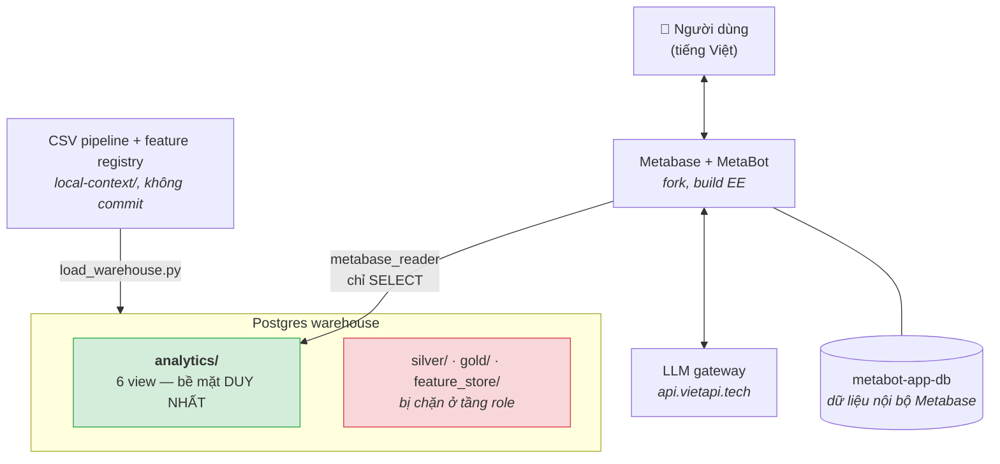
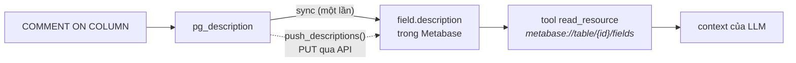
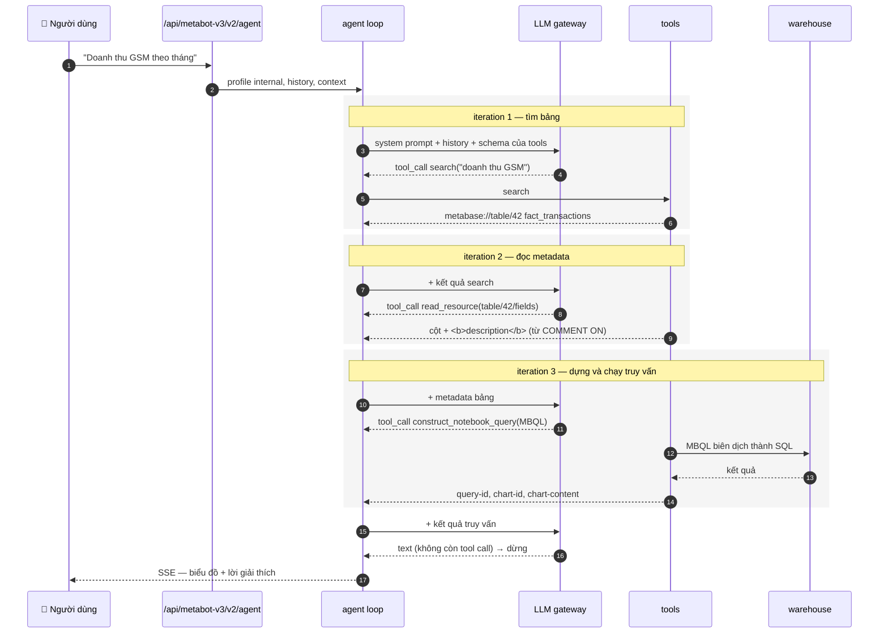
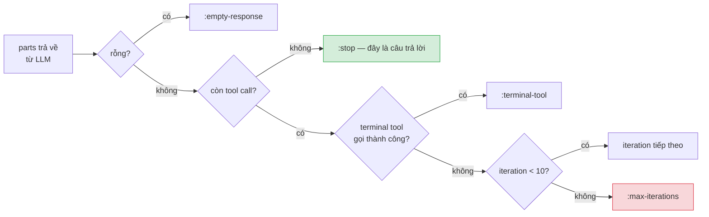
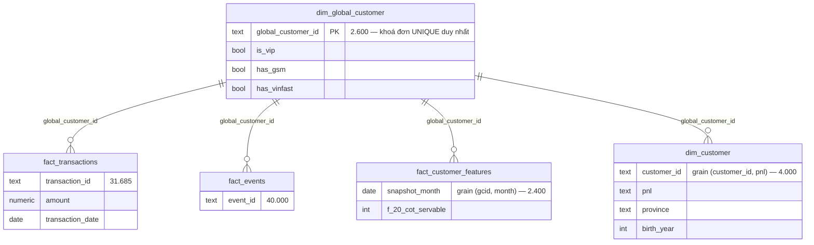
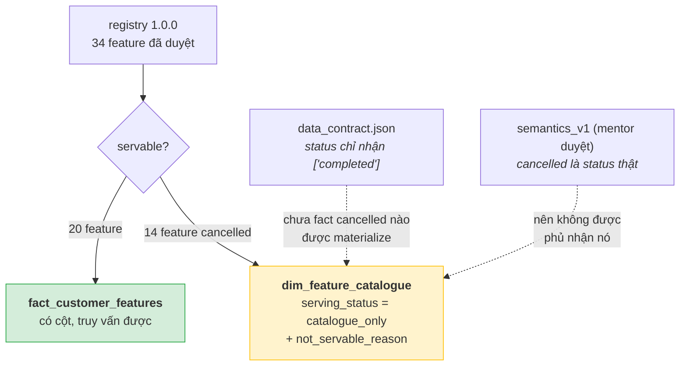
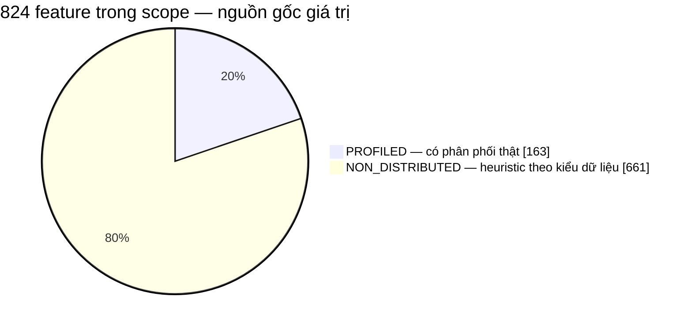

# MetaBot POC — kiến trúc

Hệ thống đang chạy: thành phần, luồng dữ liệu, và lý do của những quyết định không
hiển nhiên.

## 1. Tổng thể



Ba container. App DB tách khỏi warehouse để Metabase không bao giờ có đường ghi vào
kho dữ liệu.

## 2. Vì sao dùng Metabase thay vì tự viết text-to-SQL

Đề bài nói "text to SQL engine". MetaBot không sinh SQL — nó sinh **MBQL**, một cây
truy vấn có cấu trúc, rồi Metabase biên dịch xuống SQL.

| Được | Mất |
| --- | --- |
| Không SQL injection; MBQL sai thì fail lúc dựng, không phải lúc chạy | Không kiểm soát trực tiếp SQL sinh ra |
| Phân quyền ép ở tầng Postgres | Bị giới hạn trong những gì MBQL biểu diễn được |
| Bảng/biểu đồ tự render, người dùng bấm sửa được | |

## 3. Kênh duy nhất để tác động lên model

POC **không có license `:ai-controls`** → không sửa được system prompt. Điều đó ép ra
kiến trúc tốt hơn: mọi tri thức nghiệp vụ nằm trong **metadata của dữ liệu**.



Nếu comment không tới được Metabase, model vẫn chạy bình thường — chỉ là mù. Hỏng im
lặng, nên phải verify.

### Cạm bẫy: sync không cập nhật mô tả đã có

Metabase chép comment **một lần duy nhất, lúc sync phát hiện ra cột**, sau đó không
đụng vào `description` nữa. **Mọi lần sửa `COMMENT ON` của cột đã tồn tại đều bị bỏ
qua**, im lặng.

Phát hiện muộn: `fact_transactions.status` trong Metabase vẫn là câu cũ *"Every row is
'completed'"* rất lâu sau khi được viết lại. **18 mô tả đã lệch.**

`verify_descriptions()` không bắt được vì nó hỏi "có mô tả không", không hỏi "có đúng
mô tả hiện tại không". Xử lý: `push_descriptions()` đọc thẳng `pg_description` rồi
`PUT` những mô tả lệch.

### Mô tả là điều kiện cần, không phải điều kiện đủ

Với `claude-opus-4-8`, MetaBot **tự** nêu doanh thu VinFast bằng 0 và `status` toàn
`completed` — chỉ nhờ column comment. Nhưng `gpt-5.6-luna` trên **đúng bộ mô tả đó**
(đã xác minh khớp Postgres) trả lời cụt lủn, không nhắc cảnh báo nào.

Rõ hơn: một cảnh báo viết thẳng vào `has_gsm` rằng "đừng dùng cờ này để lọc fact theo
công ty" **không** ngăn được `gpt-5.6-luna` làm đúng điều đó — câu 10 và 12 sai y
nguyên con số cũ sau khi thêm cảnh báo.

> Metadata đặt sự thật vào tầm với của model. Model có đọc và thuật lại hay không là
> thuộc tính của model.

## 4. Một lượt hỏi đáp chạy qua đâu

Metabase bản này chạy **agent loop viết bằng Clojure** (`metabase.metabot.agent.core`),
không gọi ra AI service Python. Chat trong trình duyệt dùng profile `internal`
(`metabase.metabot.config/metabot-config`), giới hạn **10 iteration**.



Điều kiện dừng, kiểm tra sau mỗi iteration (`should-continue?`):



`:max-iterations` là **thất bại**, không phải kết thúc bình thường: model tiêu hết 10
lượt mà chưa ra câu trả lời. Đã gặp thật — Q11 gọi `construct_notebook_query` bốn lần
liên tiếp rồi bỏ cuộc, không sinh query nào.

Profile `internal` phơi ra 12 tool; bốn cái quan trọng với POC này:

| Tool | Vai trò | Ghi chú |
| --- | --- | --- |
| `search` | tìm bảng theo chủ đề | keyword + semantic |
| `read_resource` | đọc chi tiết qua URI | **kênh duy nhất mang description tới model** |
| `construct_notebook_query` | nhận MBQL 5, chạy, dựng chart | thứ harness bám vào để chấm |
| `analyze_chart` | đọc lại kết quả để bình luận | |

Không tool nào nhận SQL thô ở profile này. `create_sql_query` có trong danh sách nhưng
thuộc luồng SQL editor, không phải luồng hỏi đáp.

**Chỗ harness cắm vào.** `run_acceptance.py` đọc stream SSE, lấy pMBQL từ
`data-state.queries` — tức **đúng cây truy vấn `construct_notebook_query` đã dựng** — rồi
tự chạy lại qua `/api/dataset` và so với ground truth. Nên khi harness báo `NO_QUERY`
nghĩa là loop kết thúc mà không iteration nào gọi `construct_notebook_query` thành công:
model đã trả lời bằng văn xuôi, không có gì chấm được.

## 5. Tầng ngữ nghĩa: schema `analytics`



Cộng thêm `dim_feature_catalogue` (34 dòng) — **định nghĩa, không phải dữ liệu**, không
join với gì cả.

### 5.1 Vì sao có hai dimension khách hàng

Metabase chỉ khai được **FK một cột**. Mọi khoá tự nhiên còn lại đều ghép. Trỏ FK vào
`dim_customer.customer_id` sẽ join một dòng ra nhiều dòng và **nhân đôi doanh thu** —
sai âm thầm, không lỗi nào báo. `dim_global_customer` là khoá đơn duy nhất thật sự
unique, nên cả bốn FK trỏ về nó.

Nó **cố tình không mang nhân khẩu học**: trong 2.600 người, 1.400 khác ngày sinh, 1.219
khác tỉnh, 929 khác giới tính giữa hai hồ sơ PnL. Chọn một bên là bịa dữ liệu, mà giá
trị dimension bịa thì model không có cách nào biết là sai. Chỉ `is_vip` nhất quán.

### 5.2 Vì sao feature store bị pivot

Bảng serving là **EAV** — 163.200 dòng `feature_name`/`feature_value`. Model sẽ phải
đoán đúng từng ký tự chuỗi `gsm_transaction_completed_txn_count_l3m`. Pivot thành 20
cột số, mỗi cột một `COMMENT ON` **sinh tự động từ registry** nên mô tả không thể lệch
khỏi metadata đã duyệt.

Grain là `(global_customer_id, snapshot_month)`. Serving lưu mỗi người hai lần — một
lần dưới mỗi PnL, NULL cho feature của đơn vị kia. Đã kiểm chứng: **không key nào có
hai giá trị non-null**, nên gộp bằng `MAX` là lossless và cho ra thứ tốt hơn cả hai
nửa — một dòng chứa cả feature GSM lẫn VinFast, nên **so sánh cross-unit không cần
join**.

Chỉ snapshot mới nhất được phơi ra: bảng serving là content-addressed, snapshot mới
*append* chứ không ghi đè, nên pivot không lọc sẽ âm thầm trộn hai snapshot.

### 5.3 Ranh giới catalogue / executable fact

Quyết định kiến trúc quan trọng nhất trong tầng ngữ nghĩa. Registry là danh mục những
gì đã được **định nghĩa**; nó không phải bằng chứng rằng một chỉ số **trả lời được**.
Hai thứ tách nhau ở `cancelled`:



Cả hai câu trả lời hiển nhiên đều sai: *"không có giao dịch hủy"* phủ nhận một status
đã duyệt; *"7.712 giao dịch"* báo cáo snapshot chưa reconcile như thể là fact. Holdout
`H008` vì thế mang `expected_status: unsupported`.

Phân tách phải là **cấu trúc**, không phải văn bản. Lý do từ chối trở thành **dữ liệu**
để model trích dẫn, thay vì một câu nó phải tự nghĩ ra.

Đo hai lần, khác nhau ở chỗ đáng chú ý. Lần đầu MetaBot mở catalogue và dẫn đúng ràng
buộc data contract. Lần hai nó **không** mở catalogue, còn tin nhầm rằng
`fact_customer_features` vẫn chứa cột hủy — nhưng vẫn từ chối, vì cột đó thực sự không
tồn tại để mà truy vấn.

> **Phần chặn hiệu quả là việc rút cột, không phải câu chữ trong catalogue.** Bản đầu
> chỉ *mô tả* mâu thuẫn trong comment — mô tả cái bẫy không phải là đóng nó lại, cột
> vẫn truy vấn được và MetaBot vẫn trả 7.712.

### 5.4 Nguồn gốc dữ liệu, và vì sao chỉ có 34 feature

Quan trọng khi đọc mọi con số trong POC. Đầu vào của cả dự án chỉ có **hai file**:
`features_list_20260719.xlsx` và `global_txn_v3_20251101.xlsx` (sheet `nullrate`). Toàn
bộ giao dịch, sự kiện, khách hàng là **dummy sinh từ hai file đó**, seed `20260722`.



Ranh giới đó **không tôn trọng registry**: trong 20 feature đang phục vụ, **12 là
heuristic** — gồm toàn bộ 6 feature event và mọi cửa sổ ngắn hơn một tháng.

Điều này giải thích một chênh lệch từng gây bối rối: `l3m` completed cho 4.355 từ
feature store nhưng 5.419 khi tính từ fact trên **đúng cùng 200 khách**. Không phải
bug — feature `PROFILED` được lấy mẫu từ phân phối của workbook nguồn, chưa bao giờ dẫn
xuất từ bảng fact này. Khác nguồn gốc, không phải sai số.

Xử lý: thêm `distribution_status` vào catalogue, **trực giao** với `serving_status`, và
gắn cảnh báo vào đúng 12 cột đó — sinh từ manifest nên không lệch được.

**Vì sao không rút chúng đi như đã rút `cancelled`.** Hai thứ khác loại:

| | `cancelled` | heuristic |
| --- | --- | --- |
| Bản chất | **lệnh cấm** có căn cứ | **cảnh báo chất lượng** |
| Căn cứ | quyết định mentor duyệt + data contract + H008 `unsupported` | không luật nào cấm phục vụ |
| Xuất xứ | mâu thuẫn ngoài ý muốn | engineering review cố ý đưa vào, kèm giả định ghi rõ |
| Cách ép | **cấu trúc** — rút cột | **mô tả** — `distribution_status` |

Rút heuristic đi sẽ xoá sạch mảng event và là bê nguyên bài học cũ sang một tình huống
khác loại.

**Vì sao đúng 34 feature.** Chúng khớp chính xác ba review group trong
`metadata/feature_store/reviews/engineering_mvp_v1.json` — GSM transaction status counts
(14), VinFast transaction status counts (14), GSM event total counts (6) — mỗi group có
`review_basis` riêng, ký ngày 2026-08-03.

Scope P0 thật ra có **540** feature, trong đó **147 cái có phân phối thật** đang nằm
ngoài registry, kể cả những đo lường tiền tệ (`completed_original_price_sum`) mà feature
store hiện hoàn toàn thiếu. Không thêm được: mỗi dòng registry mang
`review_decision_hash` băm từ một quyết định review có thật, và DDL có
`CHECK (semantic_status = 'engineering_reviewed')`. Thêm 147 feature kia nghĩa là **đúc
hash cho một cuộc review chưa từng diễn ra**. Bảng từ chối, và nó đúng khi từ chối.
Đường mở rộng hợp lệ là một đợt review mới sinh ra registry `1.1.0`.

## 6. Bảo mật và cô lập

Phòng thủ theo lớp, mỗi lớp độc lập:

| Lớp | Cơ chế | Đã kiểm chứng |
| --- | --- | --- |
| Role | `metabase_reader`, chỉ `SELECT` trên `analytics` | `permission denied` ở silver/gold/bronze/feature_store |
| Kết nối | `schema-filters-type: inclusion` = `analytics` | sync không chạm schema khác |
| `search_path` | ghim `analytics` cho role | |
| Schema | `REVOKE ALL ... FROM PUBLIC` | |
| App DB | tách container, khác credential | |

```bash
docker run --rm --network metabot-poc_default -e PGPASSWORD=... postgres:16-alpine \
  psql -h warehouse -U metabase_reader -d bi_warehouse -tAc "select count(*) from silver.transactions"
# ERROR:  permission denied for schema silver
```

> **Cạm bẫy.** Đừng test qua `psql -h 127.0.0.1` trong container: `pg_hba.conf` của image
> postgres có `host all all 127.0.0.1/32 trust` **đứng trước** dòng scram, nên nó báo
> thành công kể cả khi mật khẩu sai. Phải test từ đúng đường mạng Metabase dùng.

## 7. Đo lường

Cả hai bộ đều **chấm bằng cách thực thi truy vấn MetaBot dựng ra**, không chấm văn bản —
văn bản muốn diễn đạt kiểu gì cũng được, còn truy vấn thì hoặc đúng cột đúng filter hoặc
không. Câu trả lời nghe hợp lý mà không có truy vấn nào phía sau bị chấm `NO_QUERY`,
không phải PASS.

| Bộ | Số câu | Đo cái gì | opus-4-8 | gpt-5.6-luna |
| --- | ---: | --- | --- | --- |
| `run_acceptance.py` | 16 | số có đúng không | **16/16** | 14/16 |
| `run_hard_questions.py` | 10 | khi không có đáp án, nêu giới hạn hay bịa | 5/9 | 4/10 |

Câu 1–13 đo truy vấn một bảng; câu 14–16 bắt buộc join — vì 13/13 của bộ cũ **không nói
gì** về khả năng join, đúng thứ Sprint 2 đòi. Bộ hard chấm bằng regex nên **thô**; báo
cáo luôn in nguyên văn để đọc lại.

## 8. Vòng lặp phát triển

Build lại image mất 17–40 phút, nên có `patch_prompts.py`: chép jar gốc ra `.cache/`,
thay resource, đẩy ngược vào container, restart — **~80 giây**.

Giới hạn: nó chỉ thay được **file resource**, không thay được hằng số đã biên dịch. Ví
dụ đã gặp: `security.clj` khai `inline-js-hashes` là `^:const`, AOT nội tuyến digest
thẳng vào bytecode, nên vá file JS không đổi được header CSP — bắt buộc rebuild.

## 9. Những cái đã cắn, ghi lại để khỏi cắn lại

**CRLF, hai lần.** Lần một: shebang `run_metabase.sh` thành `#!/bin/bash\r`, container
chết với `no such file or directory`. Lần hai tinh vi hơn: `security.clj` hash **bytes
file**, còn trình duyệt hash nội dung **sau khi HTML parser chuẩn hoá CRLF→LF**, nên CSP
chặn sạch script inline và trang trắng tinh — không request nào lỗi, không log nào báo.
`.gitattributes` giờ ép LF cho cả hai nhóm file.

> Bài học đắt hơn: toàn bộ test đều gọi API, chưa từng render HTML, nên lỗi này vô hình
> suốt nhiều ngày "xanh". **Một chiều chưa test là một chiều chưa biết.**

**Timezone.** `transaction_date` là `TIMESTAMPTZ`; `::DATE` trần resolve theo session
zone. Dưới `America/Los_Angeles` cho ra **13 bucket tháng** và rò 59 event sang 2024-12.
Mọi phép ép kiểu ngày giờ đều ghim `AT TIME ZONE 'UTC'`.

**Mật khẩu app DB.** Postgres chỉ đọc `POSTGRES_PASSWORD` lúc initdb. Sửa `.env` sau đó
không có tác dụng lên volume đã tồn tại, và triệu chứng là một stack trace
`ExceptionInInitializerError` dài loằng ngoằng che mất nguyên nhân thật.

**Protocol stream đổi giữa hai bản build.** Từ dòng có tiền tố (`0:`, `9:`) sang SSE
`data: {"type":...}`, và truy vấn dời từ base64 trong `navigate_to` sang
`data-state.queries` dạng pMBQL. Harness im lặng thấy rỗng. Giờ parse cả hai.

**Lỗi gateway đến qua kênh text, không qua kênh error.** Quota hết bị chấm thành
`NO_QUERY` — tức chấm nhầm lỗi hạ tầng thành model trả lời sai. Giờ có
`GATEWAY_ERROR_RE` và verdict `PROVIDER_ERROR` riêng.

**Gateway không có Responses API.** Adapter `openai` của Metabase post vào
`/v1/responses`, `api.vietapi.tech` không implement route đó — 0/3 lần gọi. Đường vào là
adapter **`openrouter`** (nói `/chat/completions`): 3/3. Tên provider ở đây chỉ là định
dạng giao thức, không liên quan openrouter.ai.

**Chunk tool call lạc nhóm giết cả agent loop.** `aisdk-chunks->part`
(`metabase.metabot.self.core`) là một `case` đóng, và hai chunk của họ tool-input không
có clause: group mở đầu bằng `:tool-input-available` (parallel tool calls tách qua flush
boundary — Q15) hoặc `:tool-input-delta` (provider mở tool call không có id/name trên
chunk đầu nên adapter không emit start — Q11). Một lỗi duy nhất biến cả turn thành
`ERROR`, harness chấm sai thành model hỏng. Đã vá cả hai clause về part `:tool-input`
thường; mất argument thì degrade về sentinel `{:_raw_arguments ""}` để schema validation
từ chối lịch sự thay vì crash. Bài học chung: adapter giả định stream well-formed, còn
gateway free thì đúng là nơi phát sinh shape lạ — mọi `case` trên chunk type đều cần
nghĩ tới chuyện thiếu vắng chunk mở đầu.

## 10. Còn thiếu

- Q10/Q12 vẫn sai trên `gpt-5.6-luna`; bản vá ở tầng mô tả đã chứng minh là không đủ.
- Chấm bằng regex là thô. Đo nghiêm túc cần LLM-judge hoặc rubric chấm tay.
- Sprint 3 (quét chủ động hằng đêm, đẩy summary lên kênh) chưa bắt đầu.
