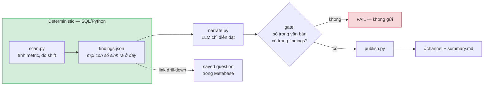

# Sprint 3 — Autonomous Storytelling & Handoff, kế hoạch

Đề bài: *"A scheduled daily job that detects notable data shifts across the feature
store and publishes a plain English executive summary to a designated team channel.
Delivery of final documentation and a closing presentation."*

---

## 0. Ràng buộc quyết định toàn bộ thiết kế: dữ liệu này không có xu hướng

Trước khi lên kiến trúc, tôi đo phân phối thật của `silver/transactions.csv`. Kết quả
làm đổi hẳn hình dạng của sprint này.

**Số giao dịch theo tháng gần như phẳng, doanh thu thì nhảy loạn:**

| Tháng | Giao dịch | Doanh thu (triệu) |
| --- | ---: | ---: |
| 2025-06 | 2.537 | 82,9 |
| 2025-07 | 2.370 | **96,2** |
| 2025-08 | 2.367 | 64,7 |
| 2025-09 | 2.747 | **58,3** |
| 2025-10 | 2.727 | 78,8 |

Số giao dịch dao động ±8%. Doanh thu dao động ±25%, và tháng 9 thấp hơn tháng 7 **39%**
trong khi *số giao dịch lại tăng 16%*. Lý do:

```
median amount        = 0          (64% giao dịch có amount = 0)
p99                  = 479.908
top 1% giao dịch     = 37% tổng doanh thu
```

Khoảng **27 giao dịch mỗi tháng quyết định hơn một phần ba doanh thu tháng đó**. Đuôi
nặng cỡ này thì trung bình tháng không ổn định, và mọi "biến động" tháng qua tháng đều
là **nhiễu lấy mẫu**, không phải tín hiệu.

Thêm hai chỗ nữa không có tín hiệu:

- **VinFast: 377 giao dịch cả năm, doanh thu làm tròn ra 0.** Mọi tỉ lệ phần trăm trên
  mẫu này đều vô nghĩa.
- **12 trong 20 cột feature là `NON_DISTRIBUTED`** — mỗi snapshot tháng được *lấy mẫu
  lại* từ cùng một phân phối tĩnh. Chênh lệch tháng qua tháng ở đó không chỉ là nhiễu,
  nó là nhiễu **theo đúng thiết kế của generator**.

### Hệ quả

Một scanner ngây thơ chạy trên bộ dữ liệu này sẽ **đêm nào cũng tìm ra một câu chuyện,
và đêm nào cũng bịa**. Tệ hơn chatbot bịa: không ai ngồi đó để hỏi vặn lại.

Nên mục tiêu của Sprint 3 phải phát biểu lại cho đúng:

> Không phải "tìm cho ra biến động". Là **phân biệt được biến động thật với nhiễu**, và
> im lặng khi không có gì để nói.

Và cách chứng minh nó hoạt động cũng đảo lại: chạy trên 12 tháng dữ liệu thật phải cho
**gần như không phát hiện nào**; chỉ khi tiêm một cú sốc nhân tạo thì mới được kêu.

Đây là điểm nhấn của buổi trình bày cuối, giống hệt vai trò của câu H008 ở Sprint 2.

---

## 1. Kiến trúc

Nguyên tắc duy nhất, rút từ bài học Sprint 2 (*metadata là điều kiện cần, không đủ*):
**LLM không được làm số học.**



LLM chỉ nhận `findings.json` và viết lại thành tiếng Việt. Nó **không** được cấp quyền
truy vấn, không tự chọn metric, không tự tính phần trăm. Cổng chặn ở giữa là thứ biến
nguyên tắc đó thành ràng buộc thi hành được, không phải một câu dặn trong prompt.

### Vì sao không dùng MetaBot cho phần này

Nói thẳng trong tài liệu: MetaBot là **on-demand analyst**, không phải **proactive
reporter**. Sprint 2 đo được rằng nó bỏ sót caveat khi không ai hỏi lại. Một báo cáo tự
động thì không có ai hỏi lại. Nên luồng đêm đi đường xác định, còn Metabase vẫn giữ vai
trò **đích drill-down**: mỗi finding kèm link tới một saved question thật để người đọc
bấm vào tự kiểm.

---

## 2. Thiết kế bộ dò

### 2.1 Metric quét

| Nhóm | Metric | Nguồn |
| --- | --- | --- |
| Khối lượng | số giao dịch, số event, số khách active | `fact_transactions`, `fact_events` |
| Doanh thu | tổng, trung vị, tổng đã winsorize p99 | `fact_transactions` |
| Cơ cấu | tỉ trọng theo product / province | `fact_transactions` |
| Khách hàng | số khách mới, số khách dùng cả hai PnL | `dim_global_customer` |
| Feature store | trung vị của **8 cột `PROFILED`** | `fact_customer_features` |

**12 cột `NON_DISTRIBUTED` bị loại khỏi bộ dò** — không phải vì kém quan trọng, mà vì
chênh lệch tháng của chúng là nhiễu do generator tạo ra. Đây là lần thứ hai
`distribution_status` được dùng làm ranh giới thi hành, sau `serving_status`.

### 2.2 Luật phát hiện

Ba tầng, một finding phải qua cả ba:

1. **Cỡ mẫu.** n ≥ 300 giao dịch/tháng. Loại VinFast tự động — 31 giao dịch/tháng không
   đủ để nói bất cứ điều gì.
2. **Robust z-score.** So tháng mới nhất với **trung vị + MAD** của 6 tháng trước, không
   phải mean ± sd. Đuôi nặng làm sd phồng lên và giấu mất shift thật. Ngưỡng |z| ≥ 3,5.
3. **Kiểm tra đuôi.** Với metric tiền tệ, tính lại sau khi winsorize p99. Nếu shift biến
   mất → **không phải finding về doanh thu**, mà là finding loại khác:
   *"doanh thu tháng 7 cao do 3 giao dịch lớn"* — vẫn đáng nói, nhưng nói đúng bản chất.

Ngưỡng chốt sau bước hiệu chuẩn ở mục 4.1, không bịa trước.

### 2.3 "Hằng đêm" trên dữ liệu tĩnh

Dữ liệu dừng ở 2025-12 và không có bản ghi mới. Dùng **đồng hồ mô phỏng**:

```bash
python nightly/run_nightly.py --as-of 2025-09    # coi 2025-09 là tháng vừa đóng sổ
python nightly/run_nightly.py                     # mặc định: tháng mới nhất có dữ liệu
```

Ghi rõ trong runbook rằng đây là mô phỏng. Không giấu — mà `--as-of` cũng chính là thứ
cho phép chạy backtest 12 tháng ở mục 4.1.

---

## 3. Thành phần phải viết

```
dev/metabot-poc/nightly/
├── scan.py           # metric + luật phát hiện → findings.json
├── narrate.py        # findings.json → tóm tắt tiếng Việt (LLM)
├── fidelity.py       # cổng chặn: đối chiếu từng con số trong văn bản
├── publish.py        # sink: file / Slack webhook / stdout
├── link_questions.py # tạo saved question trong Metabase cho mỗi finding
├── run_nightly.py    # điều phối
└── test_scan.py      # fixture tiêm shock + backtest
```

Cộng thêm:
- service `scheduler` trong `compose.yml` (cron trong container, không phụ thuộc host)
- `RUNBOOK.md` — vận hành, xử lý sự cố, đổi ngưỡng
- `PRESENTATION_FINAL.md`

### `fidelity.py` — phần đáng viết nhất

Trích mọi số trong văn bản LLM sinh ra, đối chiếu với `findings.json`:

- số phải xuất hiện trong findings (cho phép sai số làm tròn), **hoặc**
- suy ra được từ hai trường trong findings bằng một phép tính đã khai báo trước

Không khớp → **không gửi**, log ra và báo lỗi. Đây là câu trả lời trực tiếp cho thất bại
Q10/Q12 ở Sprint 2: ở đó không có cổng nào, model nói gì người dùng nhận nấy.

---

## 4. Cách chứng minh nó chạy đúng

### 4.1 Backtest im lặng — bài kiểm tra chính

Chạy scanner qua cả 12 tháng thật. **Kỳ vọng: gần như không finding nào.** Đo tỉ lệ báo
động giả, rồi chốt ngưỡng từ chính số đó thay vì chọn cảm tính.

Nếu nó kêu ầm ĩ trên dữ liệu không có tín hiệu, bộ dò sai — đó là kết quả cần biết, và
biết trước buổi demo.

### 4.2 Tiêm shock — bài kiểm tra độ nhạy

Fixture với biến động nhân tạo có nhãn, mỗi cái kiểm một điều khác nhau:

| Fixture | Tiêm gì | Phải phát hiện |
| --- | --- | --- |
| `volume_drop` | −35% giao dịch GSM một tháng | có |
| `revenue_tail` | 3 giao dịch 5 tỉ | có, **và phân loại đúng là do đuôi** |
| `province_shift` | dồn 20% giao dịch sang một tỉnh | có |
| `noise_only` | resample cùng phân phối | **không** |
| `low_volume` | −50% giao dịch VinFast | **không** (dưới cỡ mẫu) |

Hai dòng cuối quan trọng ngang bốn dòng đầu.

### 4.3 Kiểm tra độ trung thực số

Chạy `narrate.py` 10 lần trên cùng một findings, đếm số lần cổng chặn bắt được số bịa.
Con số đó nên được báo cáo thẳng trong buổi cuối — nó là bằng chứng định lượng cho luận
điểm chính của cả POC.

---

## 5. Kênh gửi

Mặc định **ghi file** `nightly/out/summary-YYYY-MM.md`, luôn chạy được, không cần gì
thêm. Slack là adapter tuỳ chọn bật bằng `SLACK_WEBHOOK_URL` trong `.env`.

Nếu có Slack workspace thật thì tôi bật; không thì demo bằng file kèm ảnh chụp định dạng
tin nhắn. Không chặn phần còn lại của sprint vì thiếu một cái webhook.

> Đã cân nhắc dùng **dashboard subscription có sẵn của Metabase** — nó gửi chart theo
> lịch được, nhưng gửi *mọi* lần chạy, không có khái niệm "chỉ gửi khi có gì đáng nói",
> và không sinh văn xuôi. Đúng vế "scheduled", trượt vế "detects notable shifts".

---

## 6. Thứ tự làm

| # | Việc | Ước lượng | Chặn ai |
| --- | --- | --- | --- |
| 1 | `scan.py` + backtest 12 tháng, hiệu chuẩn ngưỡng | 1 ngày | tất cả |
| 2 | Fixture tiêm shock | 0,5 ngày | |
| 3 | `narrate.py` + `fidelity.py` | 1 ngày | cần findings ổn định |
| 4 | `publish.py` + service `scheduler` | 0,5 ngày | |
| 5 | `link_questions.py` | 0,5 ngày | tuỳ chọn, làm sau cùng |
| 6 | `RUNBOOK.md` + presentation cuối | 1 ngày | |

Bước 1 phải xong trước khi động vào LLM. Nếu bộ dò còn nhiễu thì narration chỉ là bịa
cho mượt mà hơn.

---

## 7. Rủi ro

| Rủi ro | Xử lý |
| --- | --- |
| Không tiêm shock thì scanner chẳng bao giờ có gì để kể → demo trống | Demo hai lần: chạy thật (im lặng, đúng) rồi chạy trên fixture (kêu, đúng) |
| Ngưỡng chỉnh vừa khít 12 tháng này | Ghi rõ là hiệu chuẩn trên dummy; nêu cần chỉnh lại với dữ liệu thật |
| `gpt-5.6-luna` viết văn xuôi kèm số bịa | Đó là lý do có `fidelity.py`. Bắt được thì báo cáo, đừng đổi model để giấu |
| Gateway chết lúc 2 giờ sáng | Retry rồi bỏ; gửi findings dạng bảng không có narration còn hơn không gửi |

---

## 8. Điều cần chốt

Kênh gửi. Tôi **mặc định làm file + adapter Slack**, không chờ. Nếu có webhook Slack
thật cho một channel nào đó thì đưa tôi, tôi bật lên và demo đúng vế "designated team
channel" của đề bài. Không có cũng không ảnh hưởng phần còn lại.
