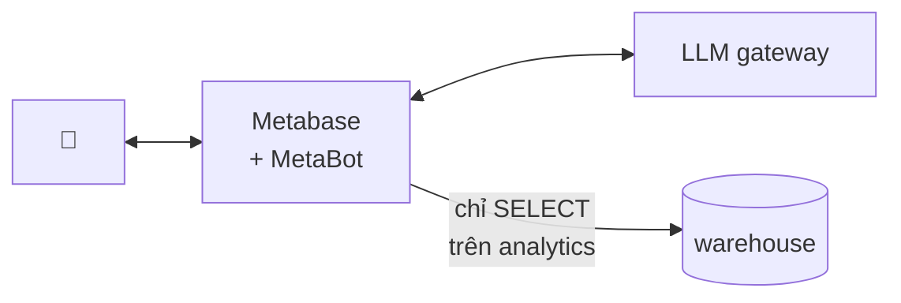
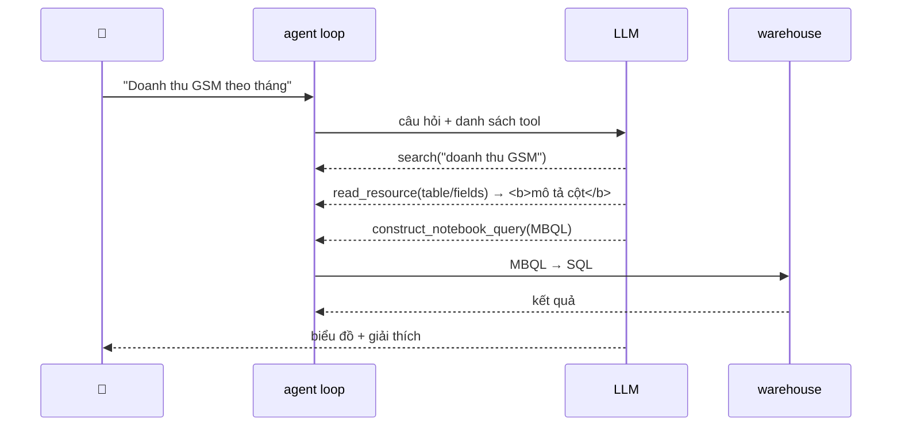
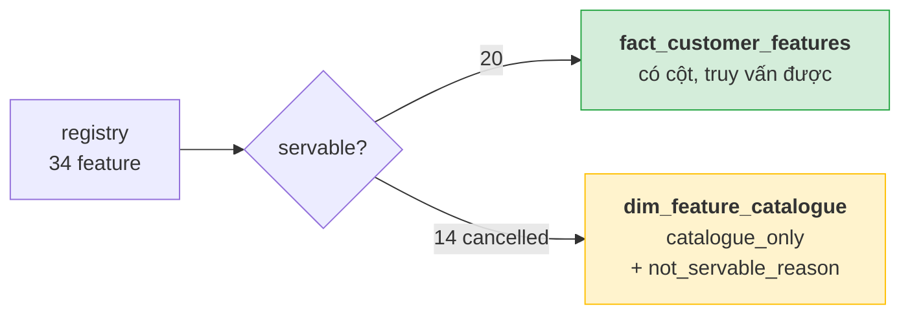
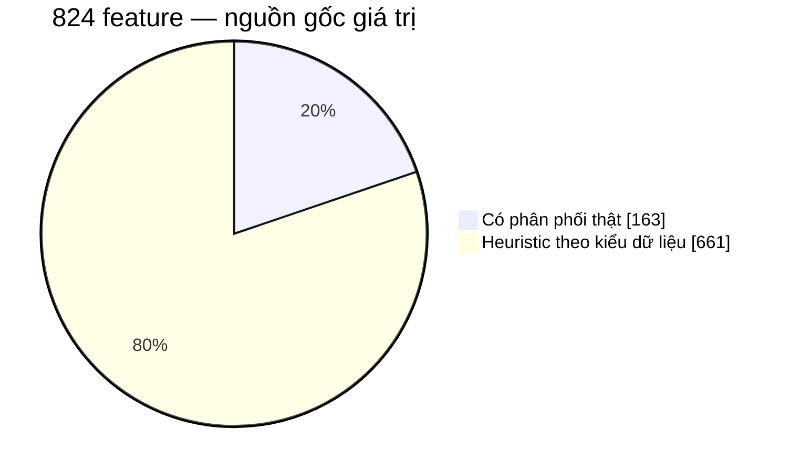

# Sprint 2 — dàn ý trình bày

Khoảng 20 phút nói + 10 phút hỏi.

Trước khi trình bày: chạy lại `run_acceptance.py` và `run_hard_questions.py` để có số
mới nhất, và kiểm tra gateway còn quota.

---

## 1. Mở đầu (1 phút)

> Quản lý nghiệp vụ cần số liệu, phải chờ engineer viết query. Hệ thống này cho hỏi
> bằng tiếng Việt, nhận về số đúng — hoặc nhận về lý do rõ ràng vì sao không có số.

Nhấn vế thứ hai ngay từ đầu. Đó là phần tốn nhiều công nhất của sprint.

## 2. Demo trực tiếp (4 phút) — làm trước, giải thích sau

Ba câu, theo đúng thứ tự:

1. **"Doanh thu GSM theo tháng"** — ra biểu đồ ngay. Thiết lập lòng tin.
2. **"Có bao nhiêu khách hàng dùng cả GSM và VinFast?"** — cross-unit, ra 1.400. Chỉ vào
   chỗ nó tự giải thích *"mỗi người một dòng, unique theo global_customer_id, nên mỗi
   khách được đếm đúng một lần"*.
3. **"Số giao dịch bị hủy của GSM theo tỉnh?"** — **nó từ chối**, và nêu đúng lý do.

Câu 3 là điểm nhấn của cả buổi. Đừng vội chuyển slide, để người xem đọc hết câu trả lời.

> Dự phòng: quota gateway có thể hết giữa demo. Chuẩn bị sẵn ảnh chụp cả ba câu.

## 3. Đã làm được gì (2 phút)

| | |
| --- | --- |
| Chat interface tiếng Việt | chạy trên trình duyệt, không viết frontend |
| Trả về bảng / biểu đồ | người dùng bấm vào sửa được |
| Câu hỏi nhiều business unit | có số đối chiếu, 16/16 |
| Join nhiều entity | 3 câu join bắt buộc, đều PASS |
| Từ chối có căn cứ | ép bằng cấu trúc dữ liệu |
| Bộ đo tự động | 26 câu, chấm bằng cách chạy truy vấn thật |

## 4. Kiến trúc (4 phút) — ba quyết định

Một câu hỏi đi qua **agent loop**, tối đa 10 vòng, mỗi vòng model chọn gọi tool hay trả
lời. Loop dừng khi model thôi gọi tool:

Nói kèm một câu: bộ đo bám vào đúng cây MBQL ở bước áp chót, nên nó chấm **truy vấn**,
không chấm lời văn.

**a) Sinh MBQL, không sinh SQL thô.** Truy vấn có cấu trúc rồi mới biên dịch xuống SQL:
không injection, sai thì fail lúc dựng, và phân quyền ép ở tầng Postgres — MetaBot có cố
trỏ vào `silver` cũng bị từ chối.

**b) Tri thức nghiệp vụ nằm trong metadata, không nằm trong prompt.** Mọi thứ model biết
đều đi qua `COMMENT ON COLUMN` → `pg_description` → field description → context. Cách này
tự động đúng cho mọi công cụ khác đọc warehouse, không chỉ cho con bot này.

**c) Ranh giới catalogue / executable fact.** Xem slide 6.

## 5. Đo lường (3 phút)

Điểm mấu chốt về phương pháp: **chấm bằng cách chạy truy vấn mà bot dựng ra**, không chấm
văn bản. Câu trả lời nghe hợp lý mà không có truy vấn phía sau bị đánh `NO_QUERY`, không
phải PASS.

| Bộ | Số câu | Đo cái gì | opus-4-8 | gpt-5.6-luna |
| --- | ---: | --- | --- | --- |
| `run_acceptance.py` | 16 | số có đúng không | **16/16** | 14/16 |
| `run_hard_questions.py` | 10 | khi không có đáp án, nêu giới hạn hay bịa | 5/9 | 4/10 |

Câu 14–16 là ba câu join bắt buộc: nhóm theo cột chỉ có trong dimension nên không join là
không trả lời được.

Câu 16 là câu bẫy: `dim_customer` có grain `(customer_id, pnl)`, join thiếu `pnl` sẽ
**nhân đôi mọi con số**. Tổng ba nhóm phải bằng đúng đáp án câu 1 — kiểm được cả fan-out
lẫn giá trị.

### Cùng metadata, hai model, hai kết quả (1 phút)

Đây là kết quả đáng nói nhất của sprint, và nó đi ngược điều chúng tôi tưởng.

Với `opus-4-8`, MetaBot **tự** cảnh báo doanh thu VinFast bằng 0 và dữ liệu chỉ có 2025 —
không ai nhắc. Chạy lại `gpt-5.6-luna` trên **đúng bộ mô tả đó**, đã xác minh khớp
Postgres từng ký tự: nó vẽ biểu đồ và im lặng về việc VinFast bằng 0.

Rõ hơn nữa: viết thẳng vào `has_gsm` một cảnh báo *"đừng dùng cờ này để lọc fact theo
công ty"* **không** ngăn được luna làm đúng điều đó — hai câu sai y nguyên con số cũ sau
khi thêm cảnh báo.

> **Metadata là điều kiện cần, không phải điều kiện đủ.** Nó đặt sự thật vào tầm với của
> model; model có đọc và thuật lại hay không là thuộc tính của model.

Nếu chỉ nhìn 16/16 thì sẽ tưởng mọi thứ đều tốt. Đây là slide cho thấy bộ đo đang làm
đúng việc của nó.

## 6. Điểm nhấn kỹ thuật — vì sao bot từ chối đúng cách (4 phút)

Kể như một câu chuyện có khúc mắc.

**Bối cảnh.** Feature store có 34 feature, trong đó 14 feature đếm giao dịch bị hủy, kèm
giá trị thật trong serving.

**Cái bẫy.** `cancelled` là business status **đã được mentor duyệt** — nó có thật. Nhưng
`data_contract.json` ép `transactions.status` chỉ nhận `completed`, nên **chưa có fact
hủy nào được nạp**. Cả hai câu trả lời hiển nhiên đều sai:

- *"Không có giao dịch hủy"* → phủ nhận một status đã duyệt.
- *"7.712 giao dịch"* → báo cáo snapshot chưa reconcile như thể là fact.

**Sai lầm đầu tiên.** Bản đầu pivot cả 34 feature thành cột, rồi *mô tả* mâu thuẫn trong
comment. Nhưng mô tả cái bẫy không phải là đóng nó lại — cột vẫn truy vấn được, bot vẫn
trả 7.712.

**Cách sửa: tách bề mặt bằng cấu trúc.**

Lý do từ chối trở thành **dữ liệu để trích dẫn**, không phải câu bot tự nghĩ ra.

**Kết quả.** Bot tìm tới catalogue, trích `catalogue_only`, nêu đúng ràng buộc data
contract, không trả số nào. Chiếu nguyên văn câu trả lời.

Chạy lần hai, bot **không** mở catalogue — nhưng vẫn từ chối, vì cột đó thực sự không tồn
tại để mà truy vấn. Nói thẳng chi tiết này: nó cho thấy phần bảo đảm nằm ở việc rút cột,
còn catalogue cải thiện chất lượng lời giải thích.

**Bài học một câu:** ranh giới governance phải là cấu trúc, không phải văn bản.

## 7. Nguồn gốc dữ liệu — nói trước khi bị hỏi (2 phút)

Slide này bảo vệ mọi con số còn lại.

Cả dự án chỉ có **hai file nguồn**: danh mục feature và một workbook thống kê phân phối.
Toàn bộ giao dịch, sự kiện, khách hàng là **dummy sinh từ hai file đó**.

Ranh giới đó cắt ngang qua tập đang phục vụ: **12 trong 20 cột là heuristic**, gồm toàn
bộ mảng event. Không mô tả nào từng nói điều đó, nên model được tự do trích một con số
bịa ra làm số liệu kinh doanh. Đã sửa: thêm `distribution_status` vào catalogue và gắn
cảnh báo vào đúng 12 cột, sinh tự động từ manifest.

Nếu bị hỏi *"sao không thêm feature cho phong phú"*: scope P0 có 540 feature, 147 cái có
phân phối thật đang nằm ngoài registry — **nhưng không thêm được một cách hợp lệ**. Mỗi
dòng registry mang `review_decision_hash` băm từ một quyết định review có thật, và DDL
chặn bằng `CHECK (semantic_status = 'engineering_reviewed')`. Thêm vào là đúc hash cho
một cuộc review chưa diễn ra. Đường mở rộng hợp lệ là một đợt review mới sinh registry
1.1.0.

> Thà ít feature mà truy được nguồn, còn hơn nhiều feature mà không ai bảo chứng.

## 8. Những cái đã cắn (2 phút) — chọn hai, đừng kể hết

- **Sync không cập nhật mô tả đã có.** Metabase chép comment **một lần duy nhất** lúc phát
  hiện ra cột, sau đó không đụng vào nữa. 18 mô tả đã lệch mà bước verify vẫn báo xanh —
  vì nó hỏi "có mô tả không", không hỏi "có đúng mô tả hiện tại không". Giờ push thẳng từ
  `pg_description` qua API.
- **CRLF làm trắng trang.** Server hash bytes file, trình duyệt hash nội dung sau khi
  parser chuẩn hoá CRLF→LF, CSP chặn sạch script inline. Không request nào lỗi, không log
  nào báo. Bài học thật: mọi test đều gọi API, chưa từng render HTML, nên lỗi này vô hình
  suốt nhiều ngày "xanh".
- **Timezone.** `::DATE` trên `TIMESTAMPTZ` resolve theo session zone; dưới
  `America/Los_Angeles` ra **13 bucket tháng**. Giờ ghim `AT TIME ZONE 'UTC'`.
- **Test bảo mật suýt cho kết quả ngược.** `psql -h 127.0.0.1` khớp dòng `trust` trong
  `pg_hba.conf` **trước** dòng scram, nên báo thành công dù mật khẩu sai. Phải test qua
  đúng đường mạng client thật dùng.

## 9. Còn thiếu và bước tiếp (2 phút)

Nói chủ động, đừng đợi bị hỏi:

- Hai câu vẫn sai trên `gpt-5.6-luna`; bản vá ở tầng mô tả đã chứng minh là không đủ, chưa
  có hướng thay thế.
- Hành vi LLM dao động giữa các lần chạy — cùng câu hỏi, cùng metadata, khác kết quả.
- Chấm bằng regex là thô. Muốn đo nghiêm túc cần LLM-judge hoặc chấm tay có rubric.
- Sprint 3 (quét chủ động hằng đêm, đẩy summary lên kênh) chưa bắt đầu.

## 10. Chốt (1 phút)

> Phần khó của sprint này không phải sinh SQL — Metabase lo. Phần khó là dạy hệ thống biết
> **khi nào không được trả lời**, và làm sao để điều đó là một thuộc tính của cấu trúc dữ
> liệu chứ không phải một câu dặn dò trong prompt.

---

## Câu hỏi có thể bị vặn

**"Sao dám chắc con số đúng?"**
Không chấm văn bản. Lấy truy vấn bot dựng, chạy thật, so với ground truth tính độc lập
bằng SQL. Câu 14–16 còn kiểm tổng các nhóm phải khớp đáp án câu 1.

**"Không có license EE thì có phải hạn chế lớn không?"**
Nó chặn việc sửa system prompt, nên mọi tri thức phải nằm trong metadata. Đo rồi: metadata
là điều kiện cần nhưng không đủ — model mạnh thì đọc, model yếu thì bỏ qua. Bù lại
metadata dùng chung được cho mọi công cụ, prompt thì không.

**"Nếu người dùng cứ đòi số giao dịch hủy thì sao?"**
Bot nêu lý do và đề xuất thứ trả lời được. Muốn có số thật thì phải nạp fact hủy và
reconcile — việc của pipeline, không phải của bot.

**"Còn dữ liệu thật, quy mô lớn hơn thì sao?"**
Chưa đo. Feature store hiện 200 khách × 12 tháng. Pivot 34 feature là view chứ không
materialize, nên số cột tăng là chỗ cần xem lại trước tiên.

**"Sao bộ hard chỉ 5/9 mà lại coi là tốt?"**
Bộ đó cố tình hỏi những câu **không có đáp án đúng**. 5/9 nghĩa là 5 lần nó nêu đúng giới
hạn thay vì bịa số — không phải 5/9 câu trả lời đúng.
