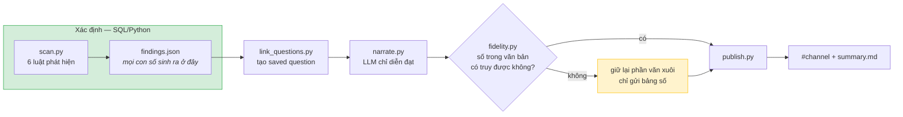
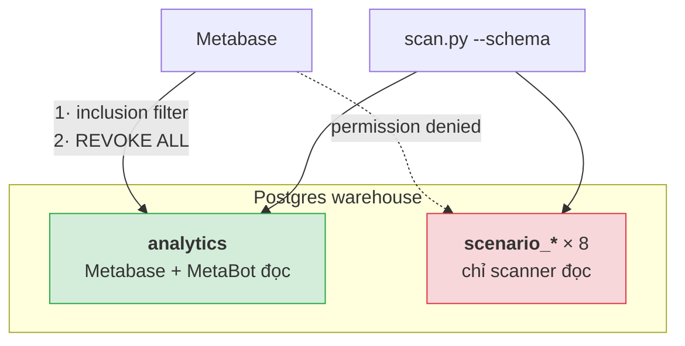

# Sprint 3 — Proactive reporter

Bản quét dữ liệu hằng đêm: phát hiện biến động đáng chú ý, viết tóm tắt tiếng Việt,
đẩy lên Slack. Tài liệu này mô tả thứ đang chạy, con số đo được, và cách vận hành.

Sprint 1–2 (chatbot hỏi đáp) nằm ở [ARCHITECTURE.md](ARCHITECTURE.md). Hai phần dùng
chung warehouse nhưng **không dùng chung đường đi** — lý do ở mục 2.

---

## 1. Ràng buộc định hình mọi thứ: dữ liệu không có xu hướng

Đo trước khi thiết kế. Số giao dịch theo tháng phẳng trong ±8%, doanh thu nhảy ±25%:

```
median amount     = 0          (64% giao dịch có amount = 0)
p99               = 479.908
top 1% giao dịch  = 37% tổng doanh thu
```

Khoảng **27 giao dịch mỗi tháng quyết định hơn một phần ba doanh thu tháng đó**. Với
đuôi nặng như vậy, mọi "biến động" tháng qua tháng đều là nhiễu lấy mẫu. Thêm hai chỗ
rỗng tín hiệu: VinFast có 377 giao dịch cả năm và doanh thu làm tròn ra 0; 12 trong 20
cột feature được **lấy mẫu lại** từ phân phối tĩnh mỗi snapshot nên delta của chúng là
nhiễu theo đúng thiết kế.

Một scanner ngây thơ ở đây sẽ **đêm nào cũng tìm ra một câu chuyện, và đêm nào cũng
bịa** — tệ hơn chatbot bịa, vì không ai ngồi đó hỏi vặn.

> Nên mục tiêu không phải "tìm cho ra biến động", mà là **phân biệt biến động thật với
> nhiễu, và im lặng khi không có gì để nói**.

Kéo theo hai bài kiểm tra ngang hàng nhau: chạy trên dữ liệu thật phải **gần như không
phát hiện gì**, và chạy trên cú sốc tiêm vào có nhãn thì phải kêu.

## 2. Kiến trúc



**Nguyên tắc duy nhất: LLM không được làm số học.** Nó nhận `findings.json` và chỉ viết
lại thành tiếng Việt — không được cấp quyền truy vấn, không tự chọn metric, không tự
tính phần trăm. `fidelity.py` là thứ biến nguyên tắc đó thành ràng buộc thi hành được
thay vì một câu dặn trong prompt.

### Vì sao không dùng MetaBot cho luồng này

MetaBot là **on-demand analyst**, không phải **proactive reporter**. Sprint 2 đo được
rằng nó bỏ sót caveat khi không ai hỏi lại — mà báo cáo tự động thì đúng là không ai
hỏi lại. Metabase vẫn giữ vai trò **đích drill-down**: mỗi finding kèm link tới một
saved question thật.

## 3. Bộ dò: 6 luật

Một finding phải qua **cả ba** luật đầu; hai luật sau bắt những thứ luật bước không với
tới; luật thứ sáu là cách đo đúng cho cột feature.

| # | Luật | Bắt cái gì |
| --- | --- | --- |
| 1 | Cỡ mẫu — n ≥ 300 dòng | loại VinFast (31 giao dịch/tháng) |
| 2 | Robust z-score — trung vị + MAD, \|z\| ≥ 3,5 | biến động bước |
| 3 | Kiểm đuôi — winsorize p99 cho metric tiền tệ | tách "vài giao dịch lớn" khỏi "tăng trưởng" |
| 4 | Xu hướng — Mann-Kendall 7 tháng | suy giảm chậm không tháng nào lệch riêng |
| 5 | Hạng mục mới — theo **tỉ trọng**, không theo số dòng | tỉnh/sản phẩm chưa từng có |
| 6 | Trung bình winsorize p95 cho cột feature | cột số nguyên đuôi nặng |

### 3.1 Ngưỡng lấy từ dữ liệu, không bốc

Ba luật đầu **chưa đủ**. Backtest 12 tháng thật — dữ liệu không có tín hiệu — cho
**2,00 finding/tháng**. Nguyên nhân: MAD sập trên cửa sổ 6 điểm. `app_open` đổi
**−4,1%** mà z = −4,43 vì baseline gần phẳng nên MAD ≈ 7.

Ba điều kiện thêm vào, mỗi cái chốt bằng số:

- **Sàn Poisson** cho chuỗi đếm — biến đếm trung bình m luôn mang ít nhất √m biến động.
- **Sàn tương đối** 15/25/45% theo họ metric, đo từ chính 12 tháng thật.
- **Chốt phi tham số** — tháng nằm trong dải min–max của sáu tháng trước thì không phải
  outlier. Đây là thứ loại `bike` +16%: 698 trong khi baseline đã từng lên 736.

Kết quả: **0,33 finding/tháng**, và cả hai đều là **một sự kiện thật** — Bình Dương
tháng 12 có 423 giao dịch, 15,4% tỉ trọng so với 11–12% mọi tháng, lệch 6,9σ so với sai
số đa thức. Báo cái đó là đúng, không phải dương tính giả.

### 3.2 Cạm bẫy `least()`

`least(NULL, 20)` trong Postgres trả về **20** — hàm này bỏ qua NULL thay vì lan truyền.
Cột feature chỉ có 119/400 dòng non-null, nên `avg(least(v, 20))` biến 281 NULL thành
281 giá trị 20 và đẩy trung bình từ 5,28 lên **15,25**, cao hơn cả trung bình chưa cắt.
Winsorize phải chặn NULL tường minh:

```sql
CASE WHEN v IS NULL THEN NULL WHEN v > cap THEN cap ELSE v END
```

## 4. Bộ fixture có nhãn

Baseline là 12 tháng 2025 **thật, giữ nguyên**; sáu tháng 2026-01..06 resample từ chính
các dòng thật rồi mới tiêm hiệu ứng. Biến động sinh từ **kịch bản nghiệp vụ**, không
sinh theo ngưỡng của bộ dò — chỉnh theo bộ dò thì bài test tự chứng minh chính nó.

| Scenario | Tiêm gì | Đo được | Phải kêu |
| --- | --- | --- | :---: |
| `tet_surge` | Tết 17/02, dồn chuyến trước Tết | taxi 670 → **1.053** (dải 557–712) | ✅ |
| `province_expansion` | mở Khánh Hòa | 0 → 128 → 334 | ✅ |
| `corporate_whale` | 4 chuyến express 8–14M | doanh thu **105M** (dải 58–96M) | ✅ |
| `pipeline_gap` | sự cố ingest event 9 ngày | event **2.661** (dải 3.253–3.437) | ✅ |
| `feature_store_shift` | đẩy 1 cột feature ×1,9 | wmean **8,96** (dải 3,45–5,41) | ✅ |
| `food_churn` (xu hướng) | −4%/tháng, cộng dồn −24% | bước lớn nhất −9% | ✅ |
| `corporate_whale` W2 | *cùng dữ liệu, winsorize p99* | 64M, trong dải 42–74M | ❌ |
| `corporate_whale` W3 | *cùng dữ liệu, đếm giao dịch* | phẳng | ❌ |
| `pipeline_gap` G2 | *cùng dữ liệu, đếm giao dịch* | phẳng | ❌ |
| `food_churn` F1 | *cùng dữ liệu, luật bước* | trong nhiễu | ❌ |
| `vinfast_push` | chiến dịch ×1,8 | 31 → 56 dòng, dưới cỡ mẫu | ❌ |
| `null` | resample, không hiệu ứng | — | ❌ |

**Sáu dòng ❌ quan trọng ngang sáu dòng ✅.** Cặp W1/W2 là cả bài kiểm tra tách đuôi:
cùng một tháng, doanh thu thô kêu, doanh thu cắt đuôi im — finding nào sống ở W1 mà chết
ở W2 thì bắt buộc phải kể là *"do bốn chuyến lớn"*, không được kể là tăng trưởng.

### 4.1 Cách ly: dữ liệu bịa không được chạm `analytics`



Biến động tiêm vào **không phải fact**. Nếu chúng nằm trong `analytics`, MetaBot sẽ trả
lời "tháng nào giảm mạnh nhất" bằng một sự kiện chưa từng xảy ra — đúng loại lỗi của 14
cột `cancelled` ở Sprint 2, chỉ khác đường vào.

Lớp REVOKE không thừa: lớp inclusion filter là một ô cấu hình sửa được trong hai cú bấm
ở admin UI, lớp REVOKE fail closed ở tầng database. Kiểm bằng chính role đó:

```
scenario_null.fact_transactions  -> BLOCKED: permission denied for schema scenario_null
analytics.fact_transactions      -> 31685
```

Ground truth Sprint 2 không suy suyển — 16 đáp án trong `EXPECTED_RESULTS.md` còn nguyên.

## 5. Cổng chặn số

`fidelity.py` coi bản tóm tắt là **văn bản không đáng tin**. Mọi token số phải truy được
về `findings.json`, trực tiếp hoặc qua một phép suy diễn khai báo trước:

**Được phép:** giá trị, mức nền, z, số dòng của bất kỳ finding nào; phần trăm thay đổi
giữa giá trị và mức nền; chênh lệch tuyệt đối; giá trị quy ra triệu/tỉ; số lượng phát
hiện; năm và tháng kỳ báo cáo; khối `context`; và **mọi con số scan tự viết vào ghi chú**.

**Không được phép:** tổng cộng qua nhiều finding, tỉ lệ giữa các finding, hay bất cứ thứ
gì dính tới con số bản quét không sinh ra.

Không đạt → **phần văn xuôi bị giữ lại**, chỉ bảng số được gửi kèm một cảnh báo. Báo cáo
cụt còn hơn báo cáo trôi chảy mang một con số không truy được nguồn.

### 5.1 Hai lỗi lộ ra khi chạy thật, cả hai của tôi

**Cổng chặn phạt đúng hành vi ngoan.** Ba scenario bị chặn vì model trích lại
`"chiếm 5,0%"`, `"xu hướng 7 tháng"`, tên chiều `..._l3m` — toàn những con số **do chính
`scan.py` viết vào trường `note`**. Trích lại chính là điều mình muốn.

**Và scan giấu mất số bản tóm tắt cần.** Hai luật diễn giải đều là khẳng định về chuỗi
**không** biến động — "doanh thu tăng nhưng sản lượng đứng yên", "sự kiện giảm mà giao
dịch không giảm". Cả hai con số đó chưa được công bố nên cổng chặn từ chối rất đúng. Đã
thêm khối `context`. *Không đáng chú ý ≠ không cần công bố.*

### 5.2 Giới hạn thật: fidelity số ≠ đúng diễn giải

Cổng chặn kiểm **số**, không kiểm **khẳng định**. Ngay khi có khối `context`, model gọi
một cú giảm 1,3% của event là "dấu hiệu sự cố thu thập dữ liệu" — vì luật diễn giải
không nói rõ cú giảm đó phải là một *phát hiện* đã. Mọi con số đều truy được; câu văn vẫn
sai. Sửa được bằng prompt, nhưng ranh giới thì còn nguyên.

## 6. Kết quả đo

| Bài đo | Kết quả |
| --- | --- |
| Đối chiếu nhãn fixture | **12/12** — độ nhạy 6/6, độ đặc hiệu 6/6 |
| Backtest `analytics` (không tín hiệu) | **0,33 finding/tháng**, cả hai là cú Bình Dương thật |
| Scenario `null` (6 tháng, không hiệu ứng) | **0 finding** |
| Cổng fidelity qua 8 kỳ báo cáo | **8/8 đạt**, 0 lần phải viết lại |
| Link drill-down khớp số finding | card 98 trả 423, finding nói 423 |

## 7. Vận hành

### Chạy tay

```bash
cd dev/metabot-poc/nightly

python scan.py --schema analytics --backtest         # hiệu chuẩn lại ngưỡng
python run_nightly.py --as-of 2025-12                # một chu kỳ đầy đủ
python run_nightly.py --sink file                    # không gửi Slack
python check_labels.py                               # chấm lại bộ dò
```

### Chạy tự động

```bash
docker compose --profile nightly up -d nightly
docker compose logs -f nightly
```

Mặc định 02:00 UTC, đổi bằng `NIGHTLY_AT` trong `.env`. Container `restart:
unless-stopped`, và một đêm lỗi không làm chết lịch — `run_nightly.py` bắt exception
rồi ngủ tiếp.

### Dựng lại fixture

```bash
cd ../warehouse
python gen_scenario_data.py          # seed cố định, tái lập được
python load_scenario.py              # COPY, ~30s/scenario
python load_scenario.py --drop       # dọn sạch
```

CSV (~530 MB) bị gitignore; `labels.json` là hợp đồng và được commit.

### Suy giảm khi có sự cố

| Hỏng cái gì | Hậu quả |
| --- | --- |
| Gateway LLM | mất phần văn xuôi, vẫn gửi bảng số |
| Metabase | mất link drill-down, vẫn gửi báo cáo |
| Slack | vẫn ghi file `out/summary-YYYY-MM.md` |
| Warehouse | **dừng hẳn**, báo lỗi rõ |

### Đổi ngưỡng

Sửa hằng số đầu `scan.py`, rồi **bắt buộc** chạy lại cả hai:

```bash
python scan.py --schema analytics --backtest    # phải giữ ~0 trên dữ liệu thật
python check_labels.py                          # phải giữ 12/12
```

Nới ngưỡng để bắt thêm mà không chạy backtest là cách chắc chắn nhất để quay lại 2,00
finding/tháng.

## 8. Đã biết là chưa làm được

- **Ngưỡng hiệu chuẩn trên dummy.** Có dữ liệu thật thì phải chạy lại `--backtest` và
  chốt lại toàn bộ. Con số 15/25/45% và Poisson floor gắn với phân phối hiện tại.
- **Feature store không tham gia dò được thật sự.** Giá trị feature được lấy mẫu mỗi
  snapshot chứ không dẫn xuất từ fact, nên một biến động ở tầng fact **không thể** lan
  sang. Scanner vẫn quét 8 cột `PROFILED` và trên dữ liệu này nó im — đúng, và lý do
  nằm ở pipeline chứ không ở scanner.
- **Cổng chặn không kiểm diễn giải** (mục 5.2).
- **Không phát hiện hạng mục biến mất**, chỉ phát hiện hạng mục mới.
- **Link drill-down chỉ có với `analytics`** — hệ quả cố ý của mục 4.1, nên các finding
  thú vị nhất trong demo lại không bấm được.
